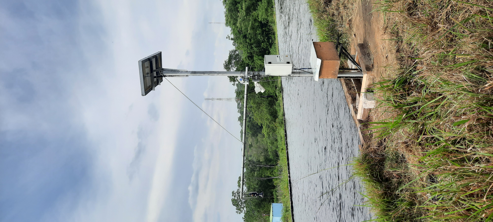

.. _readme::

================
NodeOpenRiverCam
================

|pypi| |piwheels| |docs_latest| |license|

  Both NodeOpenRiverCam and LiveOpenRiverCam are currently under development for their first release. The first
  release of both OpenRiverCam components is planned in May 2024. Until that time please stay up to date on this
  page. The documentation will change significantly during this period. We do not provide any feedback on questions
  until the first release is out.

What is NodeOpenRiverCam
========================

NodeOpenRiverCam enables velocimetry analysis and discharge estimation of videos in the cloud or directly on a site,
using the underlying pyOpenRiverCam library. It is meant to operate together with a LiveOpenRiverCam server which
collects data from multiple nodeOpenRiverCam instances, orchestrates and distributes new tasks to them. You
can connect as many NodeOpenRiverCam devices to a LiveOpenRiverCam server as you want.

NodeOpenRiverCam is being developed in the TEMBO Africa project. The TEMBO Africa project has received funding from the
European Union's Horizon Europe research and innovation programme under greant agreement No. 101086209.

    NodeOpenRiverCam site with processing occurring on the fly, and data sent to the LiveOpenRiverCam platform.
    Credits SEBA and Photrack for site setup and the hardware.

Getting started
===============

To get started with NodeOpenRivercam, you will need the following:

* A device on which to setup NodeORC. This can be a local device running on the site where videos are collected or a
  cloud device. The device should be connected to internet. For local processing, the device should also have sufficient
  storage available.
* For edge-processing (i.e. on the site itself), a camera is needed that can take videos regularly and store this on a
  designated location on the device. If you use a raspberry pi, we recommend using on the same device a raspberry pi
  camera.
* Also for edge processing, water levels must be automatically collected and stored in a predefined file format. Water
  levels will then automatically be read and matched against incoming videos.
* A LiveOpenRiverCam server from which to configure the device. If you want to collect videos on a laptop, and
  connect that laptop in the field to the device, then you can also setup LiveOpenRiverCam with Docker on your laptop.
  Please visit LiveORC_ for more information how to set this up. You have to make sure that the local LiveOpenRiverCam
  instance and the device are on the same network. If you plan to configure the device in the field, we recommend to
  ensure the device can connect to a WiFi hotspot, which is available in the field. Note that no internet connection is
  needed, only a local network.
* A username and password for the LiveOpenRiverCam server. Please set this up following the documentation of LiveORC_.

And that's it! With these in place you are ready to go.

Installation
============

To install the latest release of NodeOpenRiverCam on your device, there are two options, native installation (only
on linux devices) or a docker installation (also on Windows or Mac):

Native installation
-------------------

    NodeOpenRiverCam is entirely rasperry pi compliant. You do need an ARM64 bit device (Raspberry Pi 4 or higher)
    and about 1.5GB storage for the software, excluding the operating system. We recommend a SD card of 16GB, but
    at the very least you will require 8 GB. For storage of videos and results we strongly recommend NOT to use
    the SD card as many I/O operations on SD cards are known to corrupt the SD card in due time. We recommend to
    use a USB-drive. This drive can be hot swapped if you wish to keep raw data and videos.

A native installation is highly recommended on a local device as it reduces overhead significantly. For a native
installation, please download the setup.sh script from the latest release on the device on which you wish to install it,
make the script executable and execute the script on a command line interface with the option ``--all``. The steps
are outlined below:

.. code-block:: shell

    # get script from latest release
    wget https://github.com/localdevices/nodeorc/releases/latest/setup.sh
    # make the setup script executable
    chmod +x setup.sh
    # execute script
    ./setup.sh --all

The setup procedure will ask several inputs including the url and your username and password for the LiveOpenRiverCam
server. Note that these credentials will not be stored on the device, but only used to receive a temporary access token
and refresh token. If you use a local LiveOpenRiverCam instance, then this will report on https://127.0.0.1:8000
Please use this URL and ensure that the local LiveOpenRiverCam instance is running on your computer in the same network.

You can also perform installation steps one-by-one. If you wish to see the options of the setup script, then simply
use:

.. code-block:: shell

    ./setup.sh

without any arguments.

Docker installation
-------------------
We are still working on a docker image for NodeORC. Please stay tuned. Once the docker image is there you can install
docker on your device or cloud instance and pull the image using a command such as (exact location of the image is
still to be determined):

.. code-block:: shell

    docker pull localdevice/nodeorc

We will ensure that you can also use the setup script for a docker installation, so that you can supply the required
information for setup in a similar way as a native installation.

Usage
=====

Cloud processing
----------------

    We are still working on cloud-usage of NodeOpenRiverCam. Currently only edge processing is supported. Once this
    is supported, you can setup NodeOpenRiverCam on one or more cloud-nodes, connected to a LiveOpenRiverCam platform
    and have the nodes process individual videos that are uploaded to the LiveOpenRiverCam server. This will work
    through a queueu manager.

Edge processing
---------------

If you have followed the setup script for deploying NodeOpenRiverCam, then the device should have a name, defined by
yourself, and it should be able to receive tasks and report to a LiveOpenRiverCam instance. If your device is able to
communicate to the configured LiveOpenRiverCam instance, it will announce its existence automatically. As it
is freshly configured it does not have any tasks to perform yet, and therefore it will regularly report in
(every 5 minutes) to see if any new task is available. If so, it will download and validate the task, and if the task
is valid, store it and start using it. Storing of tasks and configurations is done through a local database.

For preparing task forms (i.e. templates for performing tasks on any video coming in) we refer to the LiveORC_
documentation.

During the setup procedure, you will have identified a location to store any information related to NodeORC.
After you have set this up, everything, including the database of processed videos, callbacks, the raw videos,
processed result files (NetCDF data files, JPG images), log files, and so on, will all be stored under that same
folder. If you have selected USB-drive storage, then the USB drive is *always* mounted under ``/mnt/usb``.
The subfolder structure under this defined folder is as follows:

.. code-block::

    .
    ├── nodeorc_data.db     <- database holding records of nodeorc videos and callbacks.
    ├── log                 <- folder holding log files in subfolders. One subfolder is created per calendar day.
    ├── results             <- folder holding result files in subfolders. One subfolder is created per calendar day.
    ├── incoming            <- folder in which new video files are expected. You must configure your camera such that it
    │                          writes videos in THIS folder, using a specified naming convention with a datetime string.
    ├── failed              <- if a video fails, then the raw video will be stored here in subfolders. One subfolder is
    │                          created per calendar day.
    ├── success             <- if a video is successfully processed it will be stored here in subfolders after
    │                          processing. One subfolder is created per calendar day.
    ├── tmp                 <- during processing, a temporary folder will be created here in which the raw video and
    │                          output files will be stored. Once successful, the tmp content will be moved to
    │                          results (output) and success (raw video)
    ├── water_level         <- text or csv files are expected under this folder, holding the water level. The text
    │                          files can have specific naming conventions that include a datestring so that
    │                          water levels may be stored in files per day. The format in the files can be
    │                          defined in a configuration message.

We follow this structure to allow a better understanding of the working methods.

Getting videos into the right folder
^^^^^^^^^^^^^^^^^^^^^^^^^^^^^^^^^^^^
If you have for instance identified the USB-drive as location for storage, then incoming videos must be reported
in ``/mnt/usb/incoming``. If you for instance have a raspberry pi setup, and you want to make a regular video upon
booting the device, you may for instance run a script upon boot that looks as follows (make sure your raspi camera
is switched on and that the necessary libraries are installed). The script can be run e.g. through a cronjob or
by adding it to your profile.

.. code-block::

    #!/bin/bash
    # NOTE! THIS CODE HAS NOT BEEN TESTED.
    # make a datetime string, to identify the utc time of the video
    export trg_path="/mnt/usb/incoming"
    export dt=`date '+%Y%m%d_%H%M%S'`
    filename=${trg_path}/${dt}.h264
    # record the video
    raspivid --height 1080 --bitrate 20000000 --timeout 5 --framerate 30 --output ${filename}

For other camera setups, the manner in which you get videos in the right folder may strongly depend on the brand and
type. Most likely camera-specific settings are needed.

Configuring the file naming convention of videos
^^^^^^^^^^^^^^^^^^^^^^^^^^^^^^^^^^^^^^^^^^^^^^^^
While you may store videos in the ``incoming`` folder, nodeorc has to be able to extract the exact datetime format
from the file name. You will need to specify the file naming convention in the configuration of NodeORC. This can
be configured during the installation process, but you can also alter the video naming convention in the
LiveOpenRiverCam platform by making a new configuration message for the device.

A typical filename convention (taken from our raspberry camera example) may for instance be:

.. code-block::

    %Y%m%d_%H%M%S.h264

    The reconfiguration from LiveORC has not yet been implemented. This will be a feature in a upcoming release.

.. _LiveORC: https://github.com/localdevices/LiveORC

.. |pypi| image:: https://badge.fury.io/py/nodeopenrivercam.svg
    :alt: PyPI
    :target: https://pypi.org/project/nodeopenrivercam/

.. |piwheels| image:: https://img.shields.io/piwheels/v/:wheel
   :alt: PiWheels Version
   :target: https://localdevice.github.io/nodeorc/latest

.. |docs_latest| image:: https://img.shields.io/badge/docs-latest-brightgreen.svg
    :alt: Latest documentation
    :target: https://localdevice.github.io/nodeorc/latest

.. |license| image:: https://img.shields.io/github/license/localdevices/nodeorc?style=flat
    :alt: License
    :target: https://github.com/localdevices/nodeorc/blob/main/LICENSE

